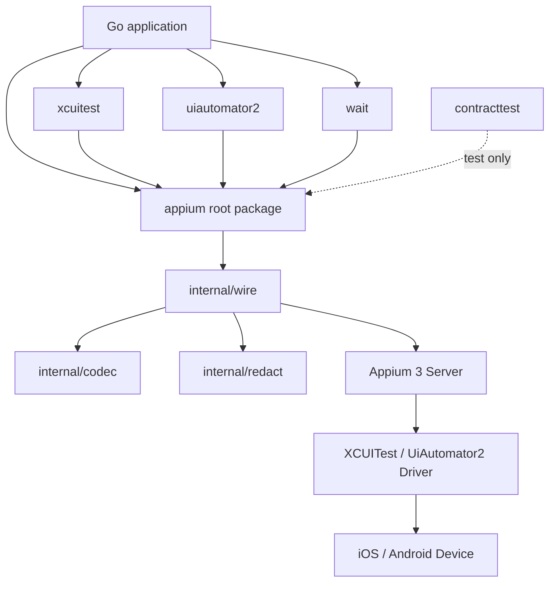

# soluna-appium-client 架构设计

> 文档状态：Draft  
> 适用阶段：v0.x 至首个稳定版本  
> 技术基线：Go 1.26.5，Appium 3.x  
> 最后更新：2026-08-29

## 1. 文档范围

本文档用于说明 `soluna-appium-client` 的整体结构、模块边界、核心抽象和长期约束。

本文档不描述具体的 HTTP 路径、请求字段、错误码映射、默认超时时间和单个命令的实现方式。这些内容分别放在以下文档中维护：

- `docs/command-semantics.md`
- `docs/error-model.md`
- `docs/coordinate-system.md`
- `docs/compatibility.md`
- `docs/release-policy.md`

架构文档只记录会影响整个项目的决策。局部实现细节不应写入本文档。

## 2. 项目定位

`soluna-appium-client` 是一个使用 Go 编写的 Appium 客户端库，面向 iOS 和 Android 移动自动化场景。

项目基于 W3C WebDriver 协议，并补充 Appium 及其移动端 Driver 所需的能力。它向调用方提供统一的 Client、Session、Element、Actions、应用控制和录屏接口，同时隔离底层 HTTP、协议解析和平台差异。

项目当前只支持 Appium 3.x，不承担 Appium 2 的兼容责任。

## 3. 范围与非目标

### 3.1 首个稳定版本的范围

首个稳定版本优先覆盖以下能力：

- Appium Server 状态检查；
- WebDriver Session 创建、访问和关闭；
- W3C Capabilities 与 Timeouts；
- 元素查找、读取和输入；
- Window Rect、Screenshot 和 Page Source；
- 基于 W3C Actions 的点击、长按和滑动；
- 应用激活、终止和状态查询；
- 屏幕录制，并支持将录屏结果直接写入 `io.Writer`；
- W3C Script Execution；
- XCUITest 与 UiAutomator2 的平台扩展；
- 结构化错误、命令观测和有界响应处理；
- 面向协议兼容性的测试工具。

新增能力应优先满足真实使用场景，不以完整复制其他语言客户端的全部 API 为目标。

### 3.2 非目标

本项目不负责：

- Appium Server、Node.js、Driver 和 Plugin 的安装或进程管理；
- 设备发现、设备占用、adb、WDA 或隧道管理；
- 测试用例组织、断言、报告和测试编排；
- 业务页面恢复和逻辑 Session 恢复；
- stale element 后自动重新定位；
- 失败命令的自动重试；
- Session 命令的自动串行化；
- 对任意 HTTP Method 和 Route 的公共 Raw Command API；
- 云端 Appium 服务商专用的 Header Provider 或认证抽象。

## 4. 总体结构

根包提供跨平台公共能力。平台包只负责各自 Driver 的特有功能。所有远端命令最终进入同一套内部传输和协议处理链路。

## 5. 包职责

| 包或目录 | 职责 |
|---|---|
| 根包 `appium` | Client、Session、Element、Capabilities、Timeouts、Actions、应用控制、录屏、脚本执行、错误和观测接口 |
| `xcuitest` | XCUITest Driver 特有能力的强类型封装 |
| `uiautomator2` | UiAutomator2 Driver 特有能力的强类型封装 |
| `wait` | 可选的显式等待与轮询条件 |
| `contracttest` | Fake Server、请求记录、协议匹配和故障场景构造 |
| `internal/wire` | HTTP 传输、Endpoint 构造、W3C Envelope 和远端错误解析 |
| `internal/codec` | JSON、Base64、UTF-8 等编解码支持 |
| `internal/redact` | 日志和错误数据脱敏 |
| `examples` | 只依赖公共 API 的最小使用示例 |
| `docs` | 架构、协议语义、兼容性和发布规则 |

依赖关系必须保持单向：

- 根包不能依赖 `xcuitest` 或 `uiautomator2`；
- 两个平台包不能互相依赖；
- `wait` 只能依赖根包；
- `contracttest` 不得进入运行时依赖；
- `internal` 中的实现不能成为公共 API 的一部分。

## 6. 核心抽象

### 6.1 Client

`Client` 表示一个固定的 Appium Server Endpoint，负责保存客户端配置并创建物理 Session。

一个 Client 可以被多个 goroutine 使用，但不负责启动或维护 Appium Server 进程。

### 6.2 Session

`Session` 表示一次远端 WebDriver 物理会话。Session 持有所属 Client、Session ID、Capabilities 快照以及与会话相关的少量协议状态。

Session 不代表可恢复的业务会话。Session 丢失后，是否创建新会话以及如何恢复现场由调用方决定。

### 6.3 Element

`Element` 表示绑定到某个 Session 的远端元素引用。

Element 不缓存文本、属性或坐标，不保存用于查找它的 Locator，也不自动处理 stale。这样可以避免客户端在不掌握页面语义的情况下执行隐式恢复。

### 6.4 Capabilities 与 Locator

Capabilities 保持开放结构，以支持 Appium Driver 和 Plugin 的扩展字段。客户端不会维护完整的 Capability 白名单。

Locator 使用明确的 Strategy 和 Value。公共 API 不接受旧名称别名，也不执行自动 normalize；调用方必须使用协议定义的策略或库提供的构造方法。

### 6.5 Error 与 Observer

Error 用于描述命令失败的事实，包括错误类别、操作、HTTP 状态、远端错误标识、命令投递状态和受限的远端数据。

Observer 用于采集命令耗时、状态和数据量等运行信息。Observer 不应改变命令结果，也不能成为业务控制入口。

## 7. 命令执行

所有远端命令必须经过统一执行链路。该链路负责：

- 校验调用参数；
- 处理 `context.Context` 的取消和截止时间；
- 构造请求地址和请求体；
- 限制请求及响应规模；
- 解析 W3C 响应；
- 转换结构化错误；
- 记录命令观测信息；
- 对日志和错误数据进行脱敏。

各业务方法不能绕过该链路自行发送 HTTP 请求。

核心客户端不自动重试远端命令。对于点击、输入、滑动、脚本执行等带副作用的操作，传输中断时无法可靠判断远端是否已经执行，自动重放会造成重复操作。

根包不公开接受任意 HTTP Method 和 Route 的 Raw Command API。W3C Script Execution 作为标准能力保留；平台特有功能应通过 `xcuitest`、`uiautomator2` 或明确的公共方法提供。

## 8. Session 与并发

Session 的生命周期只描述远端物理会话的创建、可用、关闭和丢失状态。

客户端对象应当具备并发内存安全性，但不会为同一 Session 自动串行化命令。多个 goroutine 同时发送命令时，库不承诺它们的业务执行顺序。

需要确定顺序的调用方必须在自身执行层完成调度。项目不提供可选的 Session 命令串行器。

Session 关闭操作应允许重复调用，并能够识别“远端会话已经不存在”的情况。发生网络中断时，客户端只报告当前能够确认的状态，不在后台继续清理或恢复。

## 9. 错误与诊断数据

错误模型的目标是说明发生了什么，而不是替调用方决定下一步动作。

错误至少应区分：

- 本地配置或参数错误；
- context 取消或超时；
- HTTP 传输失败；
- W3C 响应格式错误；
- Appium 远端命令错误；
- Session 丢失；
- Element 不存在或已失效；
- 响应超过限制。

对于无法确认远端是否已收到命令的情况，错误必须保留“不确定”的投递语义。公共错误不提供简单的 `Retryable` 结论。

公共错误可以暴露远端返回的数据，但必须经过大小限制和必要的脱敏。完整数据的字段形式及限制在 `docs/error-model.md` 中定义。

## 10. 资源边界与录屏

Page Source、Screenshot 和 Recording 都可能产生较大响应，必须设置硬性上限。客户端不得无界读取远端数据。

屏幕录制同时支持：

- 返回内存中的录屏数据；
- 将解码后的录屏数据直接写入 `io.Writer`。

写入 `io.Writer` 的接口属于 v0.1 范围，用于降低长录屏场景的峰值内存占用。

默认日志只记录命令名称、耗时、状态码和数据量等元数据，不记录输入文本、页面源、截图、录屏内容或完整请求体。

## 11. 平台扩展

根包只保留跨平台且语义稳定的能力。

XCUITest 和 UiAutomator2 的特有功能分别放在独立包中，并以强类型参数和结果对外提供。平台包通过根包提供的内部执行能力调用 Appium，不自行实现另一套 HTTP 传输。

平台能力进入公共 API 前，应满足以下条件：

- 有明确的实际使用场景；
- 对应 Appium 3 Driver 行为已经验证；
- 参数和返回值能够形成稳定的 Go 类型；
- 已有协议测试和真实环境测试。

### 11.1 运行时能力发现

这里的“Feature Discovery”是指：运行时向 Appium 查询当前 Session 暴露了哪些命令或扩展，再据此判断某个能力是否可用。

一旦在客户端内部缓存查询结果，就需要处理 Session 重建、Driver 或 Plugin 变化后的缓存失效问题，这就是此前所说的“缓存策略”。

首个稳定版本面向固定的 Appium 3.x 兼容矩阵，暂不提供 Commands、Extensions、Supports 等运行时能力发现 API，也不设计对应缓存。后续出现明确需求时再单独评审。

## 12. `wait` 与 `contracttest`

`wait` 是建立在公共 Session 和 Element API 之上的可选策略包。它可以重复检查条件，但不能修改 Session 配置、恢复 Session 或吞掉基础设施错误。

`contracttest` 为协议实现和外部使用方提供测试支持。它负责构造可控的 Appium 响应、记录请求并比较协议语义。该包只用于测试，不进入客户端运行时路径。

## 13. 兼容性与版本基线

项目的最低 Go 版本为 **Go 1.26.5**。

项目只支持 **Appium 3.x**。Appium Server、XCUITest Driver、UiAutomator2 Driver、iOS、Android 和设备类型的已验证组合记录在 `docs/compatibility.md` 中。

未列入兼容性矩阵的版本组合不作稳定性承诺。

v0.x 阶段允许调整公共 API，但所有破坏性变更必须记录在发布说明中。首个稳定版本发布前，以下内容应保持稳定：

- 根包与平台包的职责边界；
- Client、Session、Element 的基本对象关系；
- context 和超时语义；
- 错误及命令投递语义；
- 大响应的资源边界；
- 已声明兼容版本的协议测试结果。

## 14. 测试结构

测试分为三层：

1. 单元测试：验证参数校验、编解码、错误转换和内部状态；
2. 协议测试：通过 `contracttest` 验证请求与 W3C/Appium 响应语义；
3. 兼容性测试：在真实 Appium 3.x、XCUITest 和 UiAutomator2 环境中验证主要功能。

修复真实环境中的兼容性问题时，应补充对应的回归测试。协议测试通过不等于真实设备兼容，因此正式发布前必须执行兼容性矩阵中的实际环境测试。

## 15. 已确认的架构决策

| 编号 | 决策 |
|---|---|
| AD-001 | 项目以 Client、Session 和 Element 作为主要公共抽象 |
| AD-002 | 只支持 Appium 3.x，不兼容 Appium 2 |
| AD-003 | 最低 Go 版本为 Go 1.26.5 |
| AD-004 | 核心客户端不自动重试远端命令 |
| AD-005 | 不公开任意 Method/Route 的 Raw Extension Command API |
| AD-006 | 不提供云端 Appium 服务商专用 Header Provider |
| AD-007 | v0.1 实现将录屏结果直接写入 `io.Writer` 的能力 |
| AD-008 | 不提供 Session 命令串行器，命令顺序由调用方管理 |
| AD-009 | Locator Strategy 不做旧名称兼容和自动 normalize |
| AD-010 | 公共 Error 暴露经过大小限制和脱敏的远端数据 |
| AD-011 | 首个稳定版本不提供运行时能力发现及其缓存 |
| AD-012 | XCUITest 与 UiAutomator2 使用独立平台包，不扩张根包职责 |
| AD-013 | 根包不公开巨型 Adapter 接口，调用方按需定义接口 |

## 16. 变更规则

以下变更需要同步更新本文档，必要时增加 ADR：

- 新增或拆分公共包；
- 改变依赖方向；
- 改变 Client、Session 或 Element 的职责；
- 改变 Session 生命周期或并发语义；
- 改变超时、错误或命令投递的基本模型；
- 扩大项目支持的 Appium 主版本范围。

单个命令的参数、响应结构和兼容处理不属于架构变更，应记录在对应的详细设计或协议文档中。
