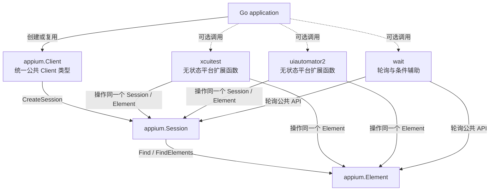
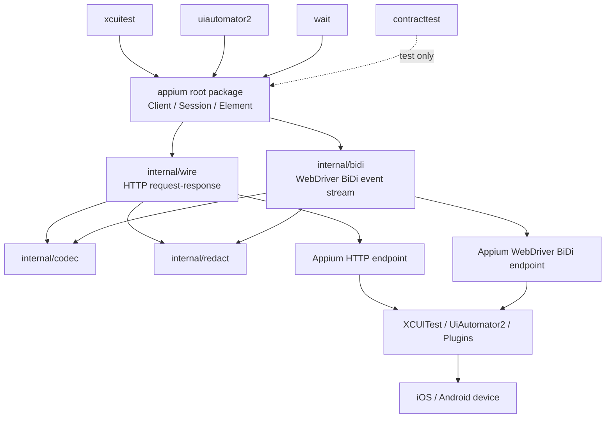

# soluna-appium-client 架构

> 文档状态：Draft  
> 适用阶段：v0.x 至首个稳定版本  
> 技术基线：Go 1.26.5，Appium 3.x  
> 最后更新：2026-08-31

## 1. 文档职责

本文档描述 `soluna-appium-client` 当前及首个稳定版本目标中的高层结构，包括系统定位、公共对象模型、包边界、依赖方向、运行链路和长期演进约束。

本文档只回答“系统由哪些部分组成、各部分负责什么、边界在哪里”，不记录命令级参数、具体实现算法、资源阈值、源码文件规划、设计取舍过程或设计决策清单。相关内容分别维护在：

- `docs/design.md`：跨领域详细设计、实现约束、待解决设计问题和设计决策索引；
- `docs/sdk-capability-matrix.md`：SDK 能力范围、公共入口、实施状态和优先级；
- `docs/command-semantics.md`：命令级参数、响应、副作用和失败语义；
- `docs/error-model.md`：错误分类、命令投递状态和诊断数据；
- `docs/coordinate-system.md`：WebDriver 坐标、截图像素及转换边界；
- `docs/compatibility.md`：真实 Appium、Driver、WDA、设备 OS 和 Host OS 组合的验证结果；
- `docs/release-policy.md`：公共 API、兼容性声明和版本发布规则。

架构文档描述当前认可的整体结构，不承担设计决策历史记录。设计理由、替代方案和后果应写入 `docs/design.md`；需要独立审议的重要决策可进一步拆成 `docs/adr/` 下的单独 ADR。

## 2. 项目定位

`soluna-appium-client` 是一个使用 Go 编写、面向 iOS 和 Android 真机自动化的 Appium 客户端库。

项目基于 W3C WebDriver 与 Appium 3 协议，为调用方提供统一的 Client、Session、Element 和通用移动自动化能力，并通过独立平台包补充 XCUITest 与 UiAutomator2 的高价值特有能力。

项目不以完整复制其他语言 Appium Client 的全部 API 为目标。公共能力以真实自动化价值、语义可验证性、资源可控性和 Host 跨平台能力为主要准入依据。

## 3. 架构目标

整体架构遵循以下目标：

- **统一公共对象模型**：调用方只面对根包定义的 Client、Session 和 Element；
- **通用能力优先**：语义稳定且跨 Driver 的能力进入根包，平台差异留在平台包；
- **单一执行语义**：所有远端交互共享一致的 context、错误、资源限制和观测边界；
- **显式状态**：不隐藏 Session 恢复、命令重试、能力 fallback 或业务状态恢复；
- **资源有界**：大型响应和持续事件流不能形成无界内存占用；
- **兼容性可验证**：SDK 范围、运行时能力和真实环境兼容性分别维护，不互相替代；
- **Host 独立优先**：平台能力可以是 iOS-only 或 Android-only，但不应无必要地绑定调用端或 Appium Host 操作系统。

## 4. 调用方对象模型

SDK 只定义一个公共 Client 类型：`appium.Client`。

连接多个 Appium Endpoint 时，调用方可以创建多个 `appium.Client` 实例；这不意味着存在 XCUITest Client、UiAutomator2 Client 或 BiDi Client 等平行公共类型。

`xcuitest`、`uiautomator2` 和 `wait` 不拥有独立 Session，也不包装根包 Session。它们接收根包创建的 `*appium.Session` 或 `*appium.Element`，并复用其所属 Client、远端 Session 身份和统一执行语义。`wait` 的 Element helper 还接受满足相同查找方法签名的本地 finder；本地 finder 不获得根包的远端 Delivery 事实，返回 malformed 结果时按本地契约错误处理。

## 5. 包依赖与运行拓扑

根包拥有公共对象模型和跨平台协议能力。平台包只能依赖根包，不能互相依赖，也不能各自实现一套独立传输。

HTTP 与 WebDriver BiDi 是同一远端 Session 的两种内部运行通道。它们可以使用不同连接和协议实现，但不能演化成调用方需要分别管理的公共 Client。

## 6. 分层职责

| 层或包 | 架构职责 |
|---|---|
| 根包 `appium` | 统一 Client、Session、Element、跨平台协议能力、公共错误和公共事件抽象 |
| `xcuitest` | 只能由 XCUITest 提供且具有明确价值的强类型扩展 |
| `uiautomator2` | 只能由 UiAutomator2 提供且具有明确价值的强类型扩展 |
| `wait` | 基于公共 API 的可选轮询与条件策略，不改变底层命令语义 |
| `contracttest` | 面向 SDK 使用方和项目自身的协议测试支持，不进入运行时依赖 |
| `internal/wire` | Appium/W3C HTTP 传输与响应处理 |
| `internal/bidi` | WebDriver BiDi 连接与事件传输；实现前可以不存在 |
| `internal/codec` | 公共执行链使用的编解码能力 |
| `internal/redact` | 错误、日志和诊断数据的脱敏支持 |
| `docs` | 架构、设计、能力、语义、兼容性和发布规则的分层维护 |

依赖方向必须保持从平台扩展和策略层指向根包，再由根包指向 `internal` 实现。`internal` 类型不得泄漏为公共 API。

## 7. 核心抽象

### 7.1 Client

`Client` 表示一个固定的 Appium Server Endpoint 和一组客户端级配置。它负责创建 Session，并为该 Client 创建的所有 Session 提供统一的传输、超时、资源限制、错误和观测基础。

Client 不负责安装、启动或维护 Appium Server、Driver、Plugin、设备、WDA 或隧道。

### 7.2 Session

`Session` 表示一次远端 WebDriver 物理会话。它绑定所属 Client、远端 Session ID 和远端确认的 Capabilities。

Session 不代表可恢复的业务会话。物理 Session 丢失后，是否创建新 Session 以及如何恢复应用状态，由上层系统负责。

### 7.3 Element

`Element` 表示绑定到某个 Session 的远端元素引用。

Element 不拥有独立连接，也不代表可自动恢复的业务元素。其生命周期受所属 Session 和远端页面状态约束。

### 7.4 平台扩展

平台扩展以无状态函数或轻量公共类型存在，接收根包 Session 或 Element。平台包只表达通用层无法稳定表达的 Driver 特有语义，不复制根包已有能力。

### 7.5 事件流

持续日志、性能和网络等数据通过与 Session 绑定的事件流抽象交付。事件流属于同一公共对象模型，不建立独立客户端层级。

## 8. 执行架构

系统包含两类远端交互：

- **命令链路**：通过 Appium HTTP 执行 W3C、Appium 和 Driver 命令；
- **事件链路**：通过 WebDriver BiDi 接收与当前 Session 相关的持续事件。

两类链路共享以下架构边界：

- Session 身份与生命周期；
- context 取消和截止时间；
- 错误与关闭语义；
- 资源限制与脱敏规则；
- Host、Driver 和设备版本兼容性声明。

平台包不能绕过根包自行建立不受这些边界约束的 HTTP 或 WebSocket 通道。

## 9. 范围边界

本项目负责 Appium 客户端协议和可复用自动化原语，不负责：

- Appium Server、Driver、Plugin、Node.js 或外部工具的安装与进程管理；
- 设备发现、设备占用、WDA 构建、WDA 安装、adb 或 RemoteXPC Tunnel 管理；
- 测试用例编排、断言、报告和业务页面模型；
- 业务状态恢复、逻辑 Session 恢复和 stale element 自动重定位；
- 对副作用命令的隐式重试；
- Session 命令的业务顺序调度；
- 任意 Method/Route 的公共 Raw HTTP 接口；
- 特定云厂商的认证和 Header 适配层。

## 10. 能力与兼容性治理

项目分别维护三类事实：

| 事实 | 维护位置 | 含义 |
|---|---|---|
| SDK 能力范围 | `docs/sdk-capability-matrix.md` | SDK 已实现、已接受、待设计、延期或排除的能力 |
| Runtime Discovery | 活动 Session 返回的能力目录 | 当前 Appium、Driver 和 Plugin 登记的命令与扩展 |
| 兼容性验证 | `docs/compatibility.md` | 已在具体 Host、Appium、Driver、WDA 和设备组合上验证的结果 |

三类事实不能互相替代。公共 API 存在不表示当前 Session 一定支持；运行时登记不表示当前设备状态一定可执行；单一组合实测通过也不扩大为其他版本或 Host 的兼容承诺。

项目当前以 Appium 3 为协议基线。设备 OS、Driver/WDA 和 Host OS 的具体支持范围由兼容性文档维护，不在架构文档中复制版本表。

## 11. 测试架构

测试分为三类：

1. 单元测试：验证本地状态、参数和编解码；
2. 协议测试：验证 HTTP/BiDi 请求、响应、事件和错误语义；
3. 兼容性测试：在真实 Appium、Driver、WDA、设备 OS 和 Host OS 组合上验证能力。

协议测试证明 SDK 对协议的实现符合预期，但不等同真实环境兼容。正式兼容声明必须来自兼容性测试记录。

## 12. 演进约束

以下变化属于架构变化，需要更新本文档：

- 新增或拆分公共包；
- 改变唯一公共 Client 模型；
- 改变 Client、Session 或 Element 的职责与所有权；
- 改变根包、平台包、策略包和 `internal` 的依赖方向；
- 引入新的远端执行通道或改变 HTTP/BiDi 的边界；
- 改变 SDK 与上层业务编排、设备管理或服务端管理的职责边界；
- 扩大项目支持的 Appium 主版本。

命令参数、错误映射、缓存策略、具体算法、资源限制、源码拆分和设计决策不直接写入本文档，应分别更新设计、语义、能力或兼容性文档。
